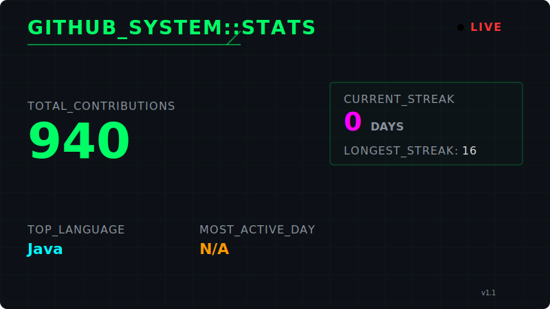

<!-- HEADER COMMENTS (legacy blocks kept as comments for reference) -->

<h2 style="display:inline-block">👋 Hey, I'm Sumit Verma — Intro & Expertise</h2>

<h1 align="center" style="color:#00FFFF;">
  Hey 👋 I'm Sumit Verma
</h1>

  

  ⚡ This README is auto-generated using a custom GitHub automation system built with <strong>Node.js</strong>, clean architecture, and scheduled CI workflows.

---

## 🧩 Domains of Expertise

<table width="800">
  <thead>
    <tr>
      <th align="left" width="200">🧭&nbsp; Focus Area</th>
      <th align="left">⚡&nbsp; Technologies</th>
    </tr>
  </thead>
  <tbody>
    <tr>
      <td><b>🖥️ Backend Dev</b></td>
      <td>
        
        
        
        
        
      </td>
    </tr>
    <tr>
      <td><b>☁️ Cloud & DevOps</b></td>
      <td>
        
        
        
        
      </td>
    </tr>
    <tr>
      <td><b>💻 Languages</b></td>
      <td>
        
        
        
        
      </td>
    </tr>
    <tr>
      <td><b>🧪 Testing</b></td>
      <td>
        
        
      </td>
    </tr>
    <tr>
      <td><b>🏛️ Architecture</b></td>
      <td>
        
        
        
      </td>
    </tr>
    <tr>
      <td><b>🗄️ Databases</b></td>
      <td>
        
        
        
        
        
        
      </td>
    </tr>
    <tr>
      <td><b>🏆 Problem Solving</b></td>
      <td>
        
        
      </td>
    </tr>
    <tr>
      <td><b>🤖 AI / LLM Tools</b></td>
      <td>
        
        
        
        
      </td>
    </tr>
  </tbody>
</table>

---

<!-- GITHUB_STATS:START -->

  
<h2>📊 GitHub Cyberpunk Stats</h2>

   
  

    <picture>
      <source media="(prefers-color-scheme: dark)" srcset="github-stats-dark.svg">
      <source media="(prefers-color-scheme: light)" srcset="github-stats-light.svg">
      
    </picture>
  

---

  
<h2>🏆 LeetCode Cyberpunk Stats</h2>

   
  

    <picture>
      <source media="(prefers-color-scheme: dark)" srcset="leetcode-stats-dark.svg">
      <source media="(prefers-color-scheme: light)" srcset="leetcode-stats-light.svg">
      
    </picture>
  

---

🐼 Auto-updated by <a href=".github/workflows/update-readme.yml">NeonPanda</a> · Sun, 05 Apr 2026 08:27:31 GMT

<!-- GITHUB_STATS:END -->

---

  
  
  
  

