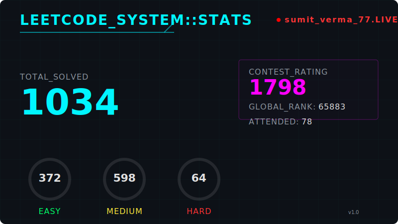

<!-- 

### 🧠 ABOUT ME  
💻 Building **scalable backends** and **automating everything**.  
☁️ Working with **Java • Spring Boot • Docker • AWS**.  
🧩 ICPC Regionalist | Cloud-native Dev | DevOps Enthusiast.  
🎯 Motto: *"Automate it before it annoys you."*

--- -->

<!-- ### ⚙️ TECH STACK  

  

 -->

<!-- ---

### 💡 FEATURED PROJECTS
| 🚀 Project | 💬 Description | 🧰 Stack |
|-------------|----------------|-----------|
| **fin-ping-service** | Smart bank request optimizer | Java • REST • Polling |
| **applynow-backend** | Authenticated Job Platform | Spring Boot • JWT |
| **cloud-ready-springboot** | CI/CD to AWS | Docker • Actions • AWS |

🔗 Explore more: [github.com/sumitverma77](https://github.com/sumitverma77)

--- -->

<!-- ### 📊 DEV ANALYTICS

  
  

 -->

<!-- ---

### 🏆 HIGHLIGHTS  

  

 -->

<!-- 
---

### 🐍 CODE FLOW

  

 -->
<!-- 

---

> 💬 *“Simplicity in architecture, elegance in logic, automation in execution.”* -->

<!-- 

  

 -->

<!-- 
 -->
<!-- 💫 ULTIMATE GITHUB PROFILE README: Sumit Verma (sumitverma77) -->
<!-- Showcasing all modern styles, animations, dynamic stats, themes, and creativity -->

<!-- 🌈 Animated Wave Header -->
<!-- 

  

 -->

<h2 style="display:inline-block">👋 Hey, I'm Sumit Verma — Intro & Expertise</h2>

<!-- 💬 Typing Intro Animation -->
<h1 align="center" style="color:#00FFFF;">
  Hey 👋 I'm Sumit Verma
</h1>

  

  ⚡ This README is auto-generated using a custom GitHub automation system built with <strong>Node.js</strong>, clean architecture, and scheduled CI workflows.

  

---

## 🧩 Domains of Expertise

| 🧭 Focus Area | ⚡ Technologies |
|---------------|----------------|
| Backend Development | Java, Spring Boot, REST, Microservices, Kafka |
| Cloud & DevOps | AWS, Docker, GitHub Actions, CI/CD |
| Languages | C, C++, Java, Sql |
| Testing | JUnit, Mockito |
| Architecture & Design | SOLID, Clean Code, Scalable Design |
| Database | Mysql, Postgresql, MongoDB, DynamoDB, Redis, ElasticSearch |
| Problem Solving | ICPC Regionalist'2024 |

---

<!-- GITHUB_STATS:START -->

  
<h2>📊 GitHub Stats — Auto-Updated</h2>

> ⚡ *Auto-generated by a custom Node.js system using GitHub REST API, clean architecture, and scheduled CI/CD.*

| Metric | Value |
|--------|-------|
| 📁 Public Repositories | **24** |
| 🌟 Total Contributions | **905** (Last Year) |
| 💾 Total Commits (All time) | **351** |
| 🧠 Primary Language (by repo usage) | **Java** |

---

  
<h3>🗂️ Recent Repositories</h3>

| Repository | Description | Language | Stars | Last Push |
|------------|-------------|----------|-------|-----------|
| [sumitverma77](https://github.com/sumitverma77/sumitverma77) |  Automation that aggregates repository insigh... | JavaScript | ⭐ 0 | today |
| [book-it-now](https://github.com/sumitverma77/book-it-now) | Real-time cinema ticket booking backend built... | Java | ⭐ 1 | 3 months ago |
| [generative-ai](https://github.com/sumitverma77/generative-ai) | Starting GenAI | N/A | ⭐ 0 | 4 months ago |
| [golang](https://github.com/sumitverma77/golang) | Getting familiar with Golang | Go | ⭐ 0 | 5 months ago |
| [Resume-](https://github.com/sumitverma77/Resume-) | No description | N/A | ⭐ 0 | 6 months ago |

---

  
<h3>🌐 Top Languages (by repo count)</h3>

| Language             | Usage                        |    Repos | Share   |
|----------------------|------------------------------|----------|---------|
| Java                 | `████████████████░░░░` | 15 repos |  78.9% |
| HTML                 | `██░░░░░░░░░░░░░░░░░░` |  2 repos |  10.5% |
| Jupyter Notebook     | `█░░░░░░░░░░░░░░░░░░░` |   1 repo |   5.3% |
| Go                   | `█░░░░░░░░░░░░░░░░░░░` |   1 repo |   5.3% |

---

  
<h3>⚡ Latest Activity</h3>

> 🔨 **[sumitverma77/sumitverma77](https://github.com/sumitverma77/sumitverma77)** · `main` · today
> 
> _"No commit message"_

---

  
<h3>🔥 Insights Engine</h3>

| Insight | Detail | Info | Extra |
|---------|--------|------|-------|
| 🏆 Most Active Repo | **[sumitverma77](https://github.com/sumitverma77/sumitverma77)** | JavaScript | ⭐ 0 |
| 📈 Commit Frequency | **31** commits in last 4 weeks | ~7.8/week | — |
| 📅 Most Active Day  | **Saturday** | — | — |

---

  
<h3>🏆 LeetCode Stats</h3>

 
  

    
  

---

🐼 Auto-updated by <a href=".github/workflows/update-readme.yml">NeonPanda</a> · Sat, 04 Apr 2026 15:05:55 GMT

<!-- GITHUB_STATS:END -->

<!-- 
## 🔥 Achievements & Highlights

  

 -->

<!-- ---

##  My Devlopment Routine

 -->

<!-- ## 🐍 Watch My Code Come Alive

  

 -->

<!-- 
## 🌈 Random Dev Quote

  

 -->

<!-- ---

## 🧬 Dynamic Badges of Power

  
  
  
  
  

 -->

<!-- ---

## 🧠 Fun Facts About Me

- 🕶️ I debug faster than I cook Maggi 🍜  
- 💡 I believe **clean code** is the best résumé  
- 🕹️ I sometimes refactor for fun (yes, really)  
- 🐧 Linux > Everything  
- 🎮 Favorite pastime: Code + Coffee + Lo-fi -->

---

  
  &nbsp;&nbsp;
  
  &nbsp;&nbsp;
  

  ⚡ <i>"Automate it before it annoys you."</i> &nbsp;—&nbsp; NeonPanda

<!-- ---

> *“If it’s repetitive, automate it. If it’s complex, simplify it. If it’s perfect, make it faster.”* ⚡ -->

<!-- 

  

 -->
