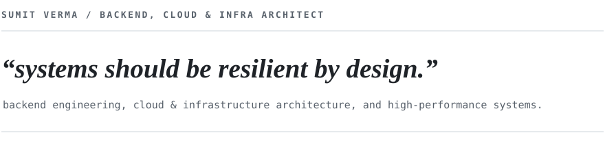
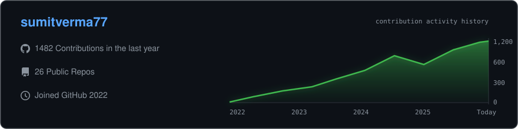
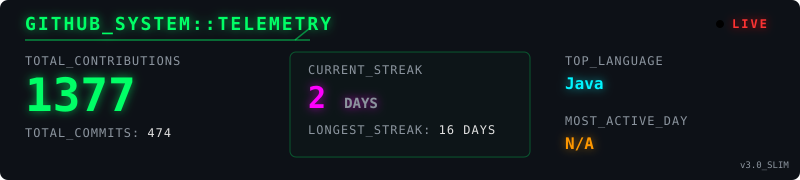
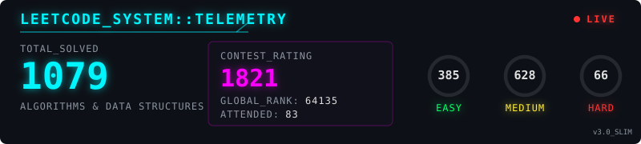

  

  &nbsp;
  &nbsp;
  

  

 

  <picture>
    <source media="(prefers-color-scheme: dark)" srcset="contribution-history-dark.svg">
    <source media="(prefers-color-scheme: light)" srcset="contribution-history-light.svg">
    
  </picture>

<!-- GITHUB_STATS:START -->

  <picture>
    <source media="(prefers-color-scheme: dark)" srcset="github-stats-dark.svg">
    <source media="(prefers-color-scheme: light)" srcset="github-stats-light.svg">
    
  </picture>

  <picture>
    <source media="(prefers-color-scheme: dark)" srcset="leetcode-stats-dark.svg">
    <source media="(prefers-color-scheme: light)" srcset="leetcode-stats-light.svg">
    
  </picture>

---

🐼 Auto-updated by <a href=".github/workflows/update-readme.yml">NeonPanda</a> · Tue, 25 Aug 2026 02:03:43 GMT

<!-- GITHUB_STATS:END -->
